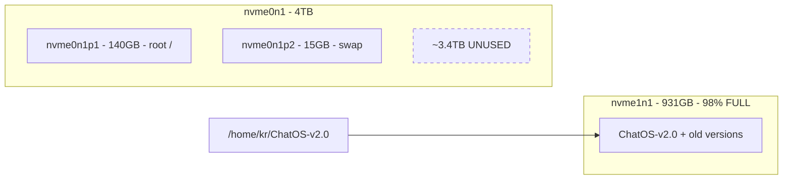
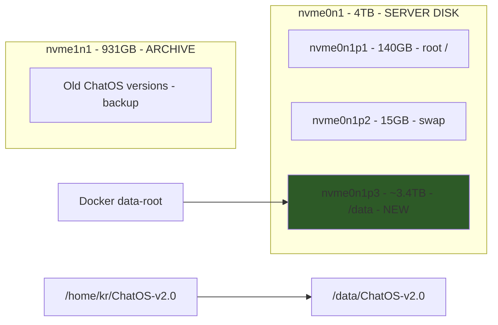

# ChatOS v2.0 - 4TB Server Migration and Validation Plan

## Current State



## Target State



---

## Phase 1: Create New Partition on 4TB Disk (MANUAL - requires sudo)

### 1.1 Check Current Partition Table

```bash
sudo fdisk -l /dev/nvme0n1
```

### 1.2 Create New Partition

Using `fdisk` or `parted`:

```bash
sudo fdisk /dev/nvme0n1
# Commands: n (new), p (primary), 3 (partition number)
# Accept defaults for start/end to use remaining space
# w (write)
```

Or with parted:

```bash
sudo parted /dev/nvme0n1
# mkpart primary ext4 155GB 100%
# quit
```

### 1.3 Format the New Partition

```bash
sudo mkfs.ext4 -L ChatOS-Data /dev/nvme0n1p3
```

### 1.4 Create Mount Point and Mount

```bash
sudo mkdir -p /data
sudo mount /dev/nvme0n1p3 /data
sudo chown kr:kr /data
```

### 1.5 Add to fstab for Persistent Mount

```bash
# Get UUID
sudo blkid /dev/nvme0n1p3

# Add to /etc/fstab:
UUID=<uuid-here> /data ext4 defaults 0 2
```

---

## Phase 2: Migrate ChatOS to New Partition

### 2.1 Create Directory Structure

```bash
mkdir -p /data/ChatOS-v2.0
mkdir -p /data/docker-data
```

### 2.2 Copy ChatOS Data

```bash
rsync -avP /media/kr/918386b7-3ea1-4917-ba84-3b464175e9bd/home/kr/ChatOS-v2.0/ /data/ChatOS-v2.0/
```

### 2.3 Update Symlink

```bash
sudo rm /home/kr/ChatOS-v2.0
sudo ln -s /data/ChatOS-v2.0 /home/kr/ChatOS-v2.0
```

### 2.4 Verify Symlink

```bash
ls -la /home/kr/ChatOS-v2.0
# Should point to /data/ChatOS-v2.0
```

---

## Phase 3: Update Docker Configuration

### 3.1 Update daemon.json

Edit `/etc/docker/daemon.json`:

```json
{
    "data-root": "/data/docker-data",
    "storage-driver": "overlay2",
    "log-driver": "json-file",
    "log-opts": {
        "max-size": "10m",
        "max-file": "3"
    }
}
```

### 3.2 Restart Docker

```bash
sudo systemctl stop docker
sudo systemctl start docker
sudo docker info | grep "Docker Root Dir"
# Should show: /data/docker-data
```

---

## Phase 4: Configure PostgreSQL Database

### 4.1 Create Database User

```bash
sudo -u postgres psql <<EOF
CREATE USER chatos WITH PASSWORD 'chatos';
CREATE DATABASE chatos_learning OWNER chatos;
GRANT ALL PRIVILEGES ON DATABASE chatos_learning TO chatos;
EOF
```

### 4.2 Initialize Auth Schema

```bash
cd /home/kr/ChatOS-v2.0
source .venv/bin/activate
python -m chatos_backend.database.init_schema
```

---

## Phase 5: Start Docker Scrapers

### 5.1 Start Docker Service

```bash
sudo systemctl enable docker
sudo systemctl start docker
```

### 5.2 Start Scraper Containers

```bash
cd /home/kr/ChatOS-v2.0/scrapers
# If docker-compose.scrapers.yml exists there, otherwise check root
docker-compose -f docker-compose.scrapers.yml up -d
```

### 5.3 Verify Containers

```bash
docker ps
# Should show: market-scraper, news-scraper, sentiment-scraper, etc.
```

---

## Phase 6: Configure Firewall

### 6.1 Run Firewall Script

```bash
sudo bash /home/kr/ChatOS-v2.0/scripts/configure-firewall.sh
```

### 6.2 Verify Rules

```bash
sudo ufw status verbose
```

Expected rules:

- Port 22 (SSH): ALLOW
- Port 80 (HTTP): ALLOW
- Port 3000: DENY (internal only)
- Port 8000: DENY (internal only)

---

## Phase 7: Restart Services and Validate

### 7.1 Restart All Services

```bash
cd /home/kr/ChatOS-v2.0

# Stop any running services
pkill -f uvicorn || true
pkill -f "next-server" || true

# Start fresh
bash scripts/start-prod.sh
```

### 7.2 Verify Services

```bash
# Backend
curl -s http://localhost:8000/api/health | jq

# Frontend  
curl -s -o /dev/null -w "%{http_code}" http://localhost:3000

# Via Caddy
curl -s http://localhost/api/health | jq
```

### 7.3 Test All Pages

```bash
for page in / /trading /editor /notes /diary /sandbox /admin \
  /admin/ip-whitelist /admin/monitoring /admin/sessions \
  /trading/journal /trading/lab /trading/automations /training; do
  echo -n "$page: "
  curl -s -o /dev/null -w "%{http_code}" "http://localhost$page"
  echo ""
done
```

---

## Phase 8: Run Full Test Suite

### 8.1 Backend Tests

```bash
cd /home/kr/ChatOS-v2.0
source .venv/bin/activate
pytest tests/ -v --ignore=tests/test_e2e.py
```

### 8.2 E2E Tests (after updating test file)

```bash
pip install playwright
playwright install chromium
pytest tests/test_e2e.py -v
```

---

## Phase 9: Final Verification Checklist

| Check | Command | Expected |

|-------|---------|----------|

| Symlink correct | `ls -la /home/kr/ChatOS-v2.0` | Points to `/data/ChatOS-v2.0` |

| Docker on 4TB | `docker info \| grep Root` | `/data/docker-data` |

| Backend healthy | `curl localhost:8000/api/health` | `{"status":"healthy"}` |

| Frontend loads | `curl -s localhost:3000` | HTML content |

| Caddy routing | `curl localhost/api/health` | Same as backend |

| Scrapers running | `docker ps` | 5+ containers |

| DB initialized | API admin endpoints | No auth errors |

| Firewall active | `sudo ufw status` | Rules shown |

| External access | `curl http://192.168.0.249/` | Page loads |

---

## Rollback Plan

If migration fails, the original data remains on nvme1n1:

```bash
# Restore original symlink
sudo rm /home/kr/ChatOS-v2.0
sudo ln -s /media/kr/918386b7-3ea1-4917-ba84-3b464175e9bd/home/kr/ChatOS-v2.0 /home/kr/ChatOS-v2.0

# Restore Docker config
sudo vim /etc/docker/daemon.json
# Change data-root back to old path
sudo systemctl restart docker
```