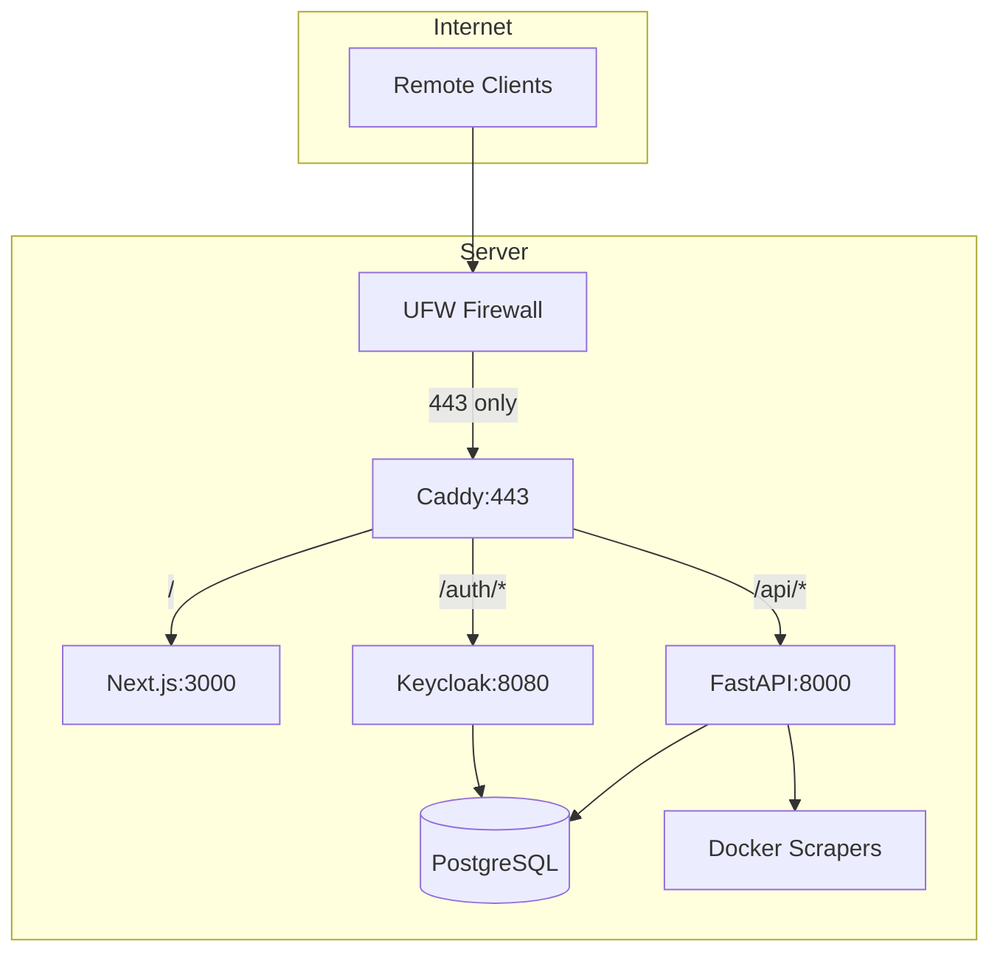

# ChatOS Private Remote Access - Complete Implementation

## Current Status Assessment

### Completed from Previous Plan

- Caddy reverse proxy configuration ([Caddyfile](home/kr/ChatOS-v2.0/Caddyfile))
- Market price display fix ([use-live-prices.ts](home/kr/ChatOS-v2.0/frontend/src/hooks/use-live-prices.ts) now uses `/api/scraped-data?type=markets`)
- Admin dashboard page ([frontend/src/app/admin/page.tsx](home/kr/ChatOS-v2.0/frontend/src/app/admin/page.tsx))
- Database auth models ([auth_models.py](home/kr/ChatOS-v2.0/chatos_backend/database/auth_models.py)) with UserSession, APIUsageLog, FeatureUsage, AuditLog
- Scraper docker-compose configuration
- Setup script and documentation

### Not Completed / Critical Gaps

| Issue | Status | Impact |

|-------|--------|--------|

| Firewall configuration | PENDING | Security risk |

| WebSocket auto-detection | MISSING | Remote access broken |

| Auth middleware | MISSING | No admin protection |

| IP Whitelist API | MISSING | No access control |

| Monitoring dashboard | MISSING | No system visibility |

| Session management | MISSING | No session control |

| Database migration | MISSING | Tables not created |

---

## Implementation Plan

### Phase 1: Fix Critical Remote Access Issues

#### 1.1 Fix WebSocket Auto-Detection

The `frontend/src/hooks/use-realtime-websocket.ts` still uses hardcoded `ws://localhost:8000`. Update to:

```typescript
const getWebSocketUrl = () => {
  if (typeof window === 'undefined') return ''
  const protocol = window.location.protocol === 'https:' ? 'wss:' : 'ws:'
  const host = window.location.host
  return process.env.NEXT_PUBLIC_WS_URL || `${protocol}//${host}/api/v1/realtime/ws`
}
```

Files to modify:

- `frontend/src/hooks/use-realtime-websocket.ts`
- `sandbox-ui/src/hooks/use-realtime-websocket.ts` (if different)

#### 1.2 Sync Admin Page to sandbox-ui

The `sandbox-ui` folder is missing the admin page. Copy from frontend:

- Copy `frontend/src/app/admin/page.tsx` to `sandbox-ui/src/app/admin/page.tsx`

---

### Phase 2: Authentication & Authorization

#### 2.1 Create Auth Middleware

Create `chatos_backend/api/auth_middleware.py`:

```python
from fastapi import Depends, HTTPException, Request
from fastapi.security import HTTPBearer

async def get_current_user(request: Request):
    # Extract and validate Keycloak token
    pass

async def require_admin_role(user = Depends(get_current_user)):
    if "admin" not in user.get("roles", []):
        raise HTTPException(status_code=403, detail="Admin access required")
    return user
```

#### 2.2 Create IP Whitelist API

Create `chatos_backend/api/routes_ip_whitelist.py`:

Endpoints needed:

- `GET /api/v1/admin/whitelist` - List whitelisted IPs
- `POST /api/v1/admin/whitelist` - Add IP to whitelist
- `DELETE /api/v1/admin/whitelist/{ip}` - Remove IP
- `POST /api/v1/admin/whitelist/import` - Bulk import IPs

#### 2.3 Create IP Whitelist Database Model

Add to `chatos_backend/database/auth_models.py`:

```python
class IPWhitelist(Base):
    __tablename__ = "ip_whitelist"
    __table_args__ = {"schema": "chatos"}
    
    id = Column(UUID, primary_key=True)
    ip_address = Column(INET, nullable=False, unique=True)
    description = Column(String(255))
    created_by = Column(UUID, ForeignKey("chatos.user_sessions.id"))
    created_at = Column(DateTime, default=datetime.utcnow)
    is_active = Column(Boolean, default=True)
```

---

### Phase 3: Monitoring & Session Management

#### 3.1 Create Monitoring API

Create `chatos_backend/api/routes_monitoring.py`:

Endpoints needed:

- `GET /api/v1/admin/monitoring/sessions` - List active sessions
- `GET /api/v1/admin/monitoring/api-usage` - API usage stats
- `GET /api/v1/admin/monitoring/feature-usage` - Feature analytics
- `POST /api/v1/admin/sessions/{id}/terminate` - Terminate session
- `POST /api/v1/admin/sessions/terminate-all` - Terminate all sessions

#### 3.2 Create Admin Sub-Pages

Create frontend admin pages:

- `frontend/src/app/admin/ip-whitelist/page.tsx` - IP management UI
- `frontend/src/app/admin/monitoring/page.tsx` - Monitoring dashboard
- `frontend/src/app/admin/sessions/page.tsx` - Session management

---

### Phase 4: Database & Infrastructure

#### 4.1 Database Schema Creation

Create migration script `chatos_backend/database/init_schema.py`:

```python
def init_auth_schema():
    engine = get_engine()
    # Create chatos schema if not exists
    engine.execute("CREATE SCHEMA IF NOT EXISTS chatos")
    # Create all tables
    Base.metadata.create_all(bind=engine)
```

#### 4.2 Configure Firewall

Execute (when ready):

```bash
sudo ufw allow 443/tcp
sudo ufw deny 3000/tcp  
sudo ufw deny 8000/tcp
sudo ufw enable
```

---

### Phase 5: Keycloak Integration Verification

#### 5.1 Verify Keycloak Configuration

- Check Keycloak realm configuration
- Verify client settings (redirect URIs, web origins)
- Test authentication flow
- Update Caddyfile to proxy `/auth/*` to Keycloak if needed

---

## Architecture Diagram



---

## File Changes Summary

### New Files to Create

- `chatos_backend/api/auth_middleware.py`
- `chatos_backend/api/routes_ip_whitelist.py`
- `chatos_backend/api/routes_monitoring.py`
- `chatos_backend/database/init_schema.py`
- `frontend/src/app/admin/ip-whitelist/page.tsx`
- `frontend/src/app/admin/monitoring/page.tsx`
- `frontend/src/app/admin/sessions/page.tsx`
- `sandbox-ui/src/app/admin/page.tsx`

### Files to Modify

- `frontend/src/hooks/use-realtime-websocket.ts` - Fix WebSocket URL
- `sandbox-ui/src/hooks/use-realtime-websocket.ts` - Fix WebSocket URL
- `chatos_backend/database/auth_models.py` - Add IPWhitelist model
- `chatos_backend/app.py` - Register new routers

---

## Verification Checklist

After implementation, verify:

- [ ] Remote WebSocket connections work (`wss://domain.com/api/v1/realtime/ws`)
- [ ] Admin dashboard accessible at `/admin`
- [ ] IP whitelist management works
- [ ] Monitoring dashboard shows real data
- [ ] Session termination works
- [ ] Firewall blocks direct port access
- [ ] Market prices display correctly (not "$ -- --")
- [ ] All trading pages functional
- [ ] Authentication flow works end-to-end