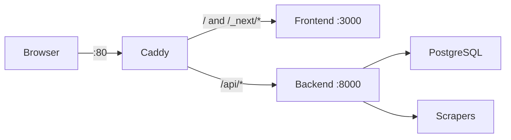

# Comprehensive ChatOS Migration Fix

## Current State

- **Software location**: `/media/kr/918386b7-3ea1-4917-ba84-3b464175e9bd/home/kr/ChatOS-v2.0/`
- **Old hardcoded paths**: `/home/kr/ChatOS-v2.0/` (no longer valid)
- **Caddyfile bug**: Only proxies exact `/` path, breaking CSS/JS loading

## Architecture Overview



---

## Phase 1: Fix Caddyfile (Immediate - CSS/JS Loading)

Update `/etc/caddy/Caddyfile` to use proper route handling:

```caddy
:80 {
    # API routes first (more specific)
    handle /api/* {
        reverse_proxy localhost:8000
    }
    
    # WebSocket routes
    handle /api/v1/realtime/ws {
        reverse_proxy localhost:8000 {
            header_up Connection "Upgrade"
            header_up Upgrade "websocket"
        }
    }
    
    # Everything else -> Frontend (catches /_next/*, /trading, etc.)
    handle {
        reverse_proxy localhost:3000
    }
}
```

---

## Phase 2: Create Symlink for Path Compatibility

Instead of updating 30+ files with hardcoded paths, create a symlink:

```bash
sudo ln -s /media/kr/918386b7-3ea1-4917-ba84-3b464175e9bd/home/kr/ChatOS-v2.0 /home/kr/ChatOS-v2.0
```

This makes all existing paths work without code changes.

---

## Phase 3: Fix Critical Scrapers Paths

Even with symlink, these files have paths that may need environment variable support:

| File | Issue |

|------|-------|

| [scrapers/market_scraper.py](home/kr/ChatOS-v2.0/scrapers/market_scraper.py) | Hardcoded DATA_DIR, LOGS_DIR |

| [scrapers/start_scrapers.sh](home/kr/ChatOS-v2.0/scrapers/start_scrapers.sh) | VENV path to text-generation-webui |

| [scrapers/aggr_scraper.py](home/kr/ChatOS-v2.0/scrapers/aggr_scraper.py) | OUTPUT_DIR default |

| [scrapers/coinglass_scraper.py](home/kr/ChatOS-v2.0/scrapers/coinglass_scraper.py) | OUTPUT_DIR default |

---

## Phase 4: Restart Services

1. Reload Caddy with new config
2. Restart frontend bound to localhost:3000
3. Verify backend is running on localhost:8000
4. Test all routes through Caddy

---

## Phase 5: Validation

1. Test `http://192.168.0.249/` loads with CSS/JS
2. Test navigation to `/trading`, `/diary`, `/notes`, `/editor`
3. Test API endpoints via `/api/health`
4. Verify port 3000 is NOT directly accessible externally

---

## Files to Modify

1. `/etc/caddy/Caddyfile` - Fix routing
2. Create symlink `/home/kr/ChatOS-v2.0`
3. Optionally update scraper configs if symlink insufficient

## Expected Outcome

- Full UI renders with styles at `http://192.168.0.249/`
- All pages navigate correctly
- API works through Caddy proxy
- Direct port 3000/8000 access blocked externally