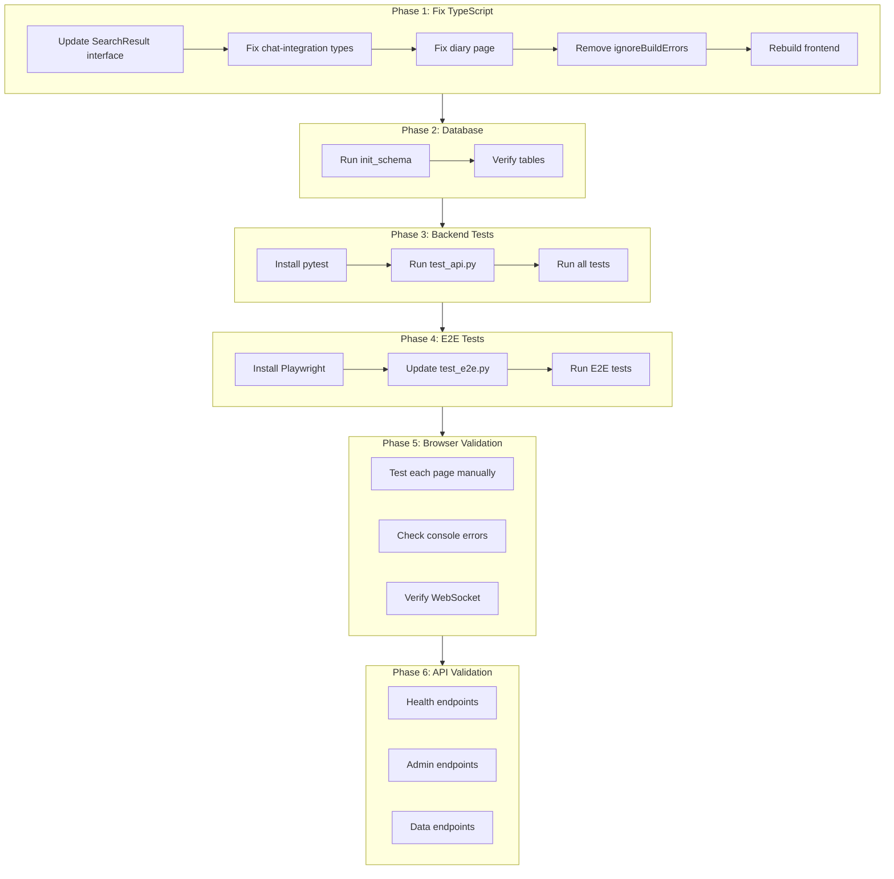

# Full System Validation and Fix Plan

## Current State Analysis

### Backend (22 API Route Files)

- Routes exist in `chatos_backend/api/routes_*.py`
- Test suite exists in `tests/` with 23 test files
- pytest framework configured with fixtures in `conftest.py`

### Frontend (14 Pages)

| Page | Path | Purpose |

|------|------|---------|

| Main | `/` | Chat interface |

| Admin | `/admin` | Dashboard |

| IP Whitelist | `/admin/ip-whitelist` | Access control |

| Monitoring | `/admin/monitoring` | System health |

| Sessions | `/admin/sessions` | User sessions |

| Diary | `/diary` | Notes/transcripts |

| Editor | `/editor` | Code editor |

| Notes | `/notes` | Note management |

| Sandbox | `/sandbox` | Code sandbox |

| Trading | `/trading` | Trading dashboard |

| Automations | `/trading/automations` | Trading bots |

| Journal | `/trading/journal` | Trade log |

| Lab | `/trading/lab` | Backtesting |

| Training | `/training` | Model training |

### Known Issues to Fix

1. **TypeScript Errors** - Build bypassed with `ignoreBuildErrors: true`

   - [diary/page.tsx](frontend/src/app/diary/page.tsx): `note_id` property missing from `SearchResult` interface
   - [diary/page.tsx](frontend/src/app/diary/page.tsx): `source` should be `sourceType` in queueChatMessage calls
   - [notes-db-api.ts](frontend/src/lib/notes-db-api.ts): SearchResult type missing `memory` and `chat_history` types

2. **E2E Tests Outdated** - [test_e2e.py](tests/test_e2e.py) targets:

   - Wrong port (8000 instead of 3000 for frontend)
   - Non-existent pages (`/settings`, `/projects`)
   - Missing tests for current pages (`/admin/*`, `/trading/*`, `/diary`)

3. **Database Schema** - Auth tables may not be initialized

---

## Phase 1: Fix TypeScript Errors

### 1.1 Update SearchResult Interface

File: [frontend/src/lib/notes-db-api.ts](frontend/src/lib/notes-db-api.ts)

```typescript
export interface SearchResult {
  id: number | string
  title: string
  content: string
  snippet: string
  score: number
  type: "note" | "transcript" | "memory" | "chat_history"
  created_at: string
  note_id?: number  // Add optional note_id for transcripts
}
```

### 1.2 Fix chat-integration.ts

File: [frontend/src/lib/chat-integration.ts](frontend/src/lib/chat-integration.ts)

Add missing properties to `PendingChatMessage`:

```typescript
export interface PendingChatMessage {
  content: string
  sourceType?: 'note' | 'search' | 'diary' | 'general'
  sourceId?: string | number
  sourceTitle?: string  // Add this
}
```

### 1.3 Fix diary/page.tsx

File: [frontend/src/app/diary/page.tsx](frontend/src/app/diary/page.tsx)

- Change `source:` to `sourceType:` in queueChatMessage calls
- Ensure null checks for `note_id` access

### 1.4 Remove ignoreBuildErrors

File: [frontend/next.config.ts](frontend/next.config.ts)

Remove the TypeScript bypass after fixes are complete.

---

## Phase 2: Initialize Database

### 2.1 Run Schema Initialization

```bash
cd ~/ChatOS-v2.0
python -m chatos_backend.database.init_schema
```

### 2.2 Verify Tables Created

```bash
python -m chatos_backend.database.init_schema --verify
```

---

## Phase 3: Run Backend Tests

### 3.1 Install Test Dependencies

```bash
pip install pytest pytest-asyncio httpx --break-system-packages
```

### 3.2 Run API Tests

```bash
cd ~/ChatOS-v2.0
pytest tests/test_api.py -v
```

### 3.3 Run All Backend Tests

```bash
pytest tests/ -v --ignore=tests/test_e2e.py
```

---

## Phase 4: Update and Run E2E Tests

### 4.1 Install Playwright

```bash
pip install playwright --break-system-packages
playwright install chromium
```

### 4.2 Update test_e2e.py

File: [tests/test_e2e.py](tests/test_e2e.py)

Key changes needed:

- Change `base_url` fixture from `localhost:8000` to `localhost:3000` (or `localhost:80` through Caddy)
- Update test classes for actual pages:
```python
# New test classes needed:
class TestAdminDashboard:
    """Tests for /admin"""

class TestAdminIPWhitelist:
    """Tests for /admin/ip-whitelist"""

class TestAdminMonitoring:
    """Tests for /admin/monitoring"""

class TestAdminSessions:
    """Tests for /admin/sessions"""

class TestTradingDashboard:
    """Tests for /trading"""

class TestTradingAutomations:
    """Tests for /trading/automations"""

class TestTradingJournal:
    """Tests for /trading/journal"""

class TestTradingLab:
    """Tests for /trading/lab"""

class TestDiaryPage:
    """Tests for /diary"""

class TestTrainingPage:
    """Tests for /training"""
```


### 4.3 Run E2E Tests

```bash
pytest tests/test_e2e.py -v
```

---

## Phase 5: Manual Browser Validation

### 5.1 Page Load Checklist

For each page, verify:

- Page loads without JavaScript errors (check browser console)
- All components render correctly
- Navigation works
- API calls succeed (check Network tab)

### 5.2 Functional Tests per Page

| Page | Key Tests |

|------|-----------|

| `/` | Chat input works, messages display |

| `/admin` | Scraper status shows, links work |

| `/admin/ip-whitelist` | Can add/remove IPs |

| `/admin/monitoring` | Stats load, auto-refresh works |

| `/admin/sessions` | Sessions list, terminate works |

| `/diary` | Create/edit/delete notes |

| `/trading` | Live prices display, charts work |

| `/trading/automations` | Bot list displays |

| `/trading/lab` | Backtest form works |

### 5.3 WebSocket Tests

Verify real-time updates on:

- Trading page (live prices)
- Automations page (bot status)

---

## Phase 6: API Endpoint Validation

### 6.1 Health Checks

```bash
curl http://127.0.0.1/api/health
curl http://127.0.0.1/api/council
```

### 6.2 Admin API Tests

```bash
curl http://127.0.0.1/api/v1/admin/monitoring/health
curl http://127.0.0.1/api/v1/admin/monitoring/sessions
curl http://127.0.0.1/api/v1/admin/whitelist
```

### 6.3 Data API Tests

```bash
curl http://127.0.0.1/api/scraped-data?type=status
curl http://127.0.0.1/api/v1/realtime/dashboard
```

---

## Validation Flow Diagram



---

## Success Criteria

- All TypeScript errors fixed (build without `ignoreBuildErrors`)
- Database schema initialized and verified
- Backend tests pass (pytest)
- E2E tests pass (Playwright)
- All 14 pages load without errors
- All API endpoints respond correctly
- WebSocket connections work
- Admin functions (IP whitelist, sessions, monitoring) operational