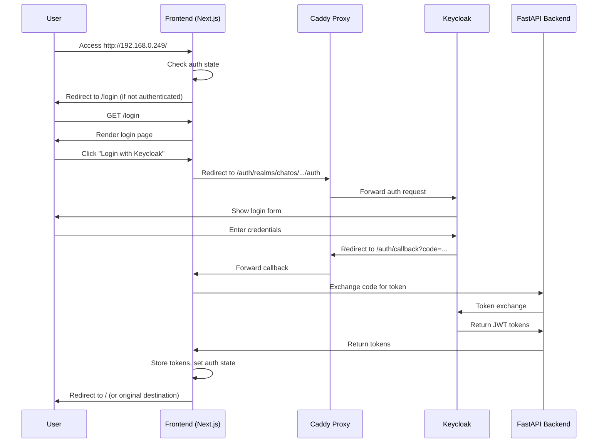

# Login Page Implementation Plan

## Overview

Implement a complete authentication flow with a `/login` page that integrates with Keycloak via OAuth 2.0, manages authentication state, and redirects unauthenticated remote users to login. The page will match the existing dark theme aesthetic and include a "Create Account" option (UI only, backend to be implemented later).

## Architecture Flow



## Implementation Steps

### 1. Create Authentication Context and Hooks

**File**: `frontend/src/contexts/auth-context.tsx`

- Create React context for authentication state
- Store JWT tokens in localStorage/sessionStorage
- Provide `useAuth()` hook for components
- Functions: `login()`, `logout()`, `isAuthenticated()`, `getToken()`

**File**: `frontend/src/lib/auth.ts`

- Keycloak OAuth configuration constants
- Token exchange logic (call backend `/api/auth/callback` or direct Keycloak)
- Token validation and refresh logic
- Helper functions for building Keycloak URLs

### 2. Create Login Page

**File**: `frontend/src/app/login/page.tsx`

- Modern login UI matching existing dark theme
- "Login with Keycloak" button (primary action)
- "Create Account" button/link (secondary, placeholder for future)
- Loading states during OAuth flow
- Error handling and display
- Responsive design
- Use existing UI components (`Button`, `Card`, etc.)
- Match color scheme: `--accent-primary` (#00d4ff), `--accent-secondary` (#ff00aa)
- Use Inter font and existing spacing/styling patterns

### 3. Create OAuth Callback Handler

**File**: `frontend/src/app/auth/callback/page.tsx`

- Handle Keycloak redirect with authorization code
- Exchange code for tokens (via backend or direct Keycloak call)
- Store tokens securely
- Update auth context
- Redirect to original destination or `/`
- Handle errors (invalid code, network errors, etc.)

### 4. Update Caddy Configuration

**File**: `/etc/caddy/Caddyfile`

- Add specific route for `/auth/callback` to frontend (port 3000) BEFORE the general `/auth/*` rule
- Ensure Keycloak auth endpoints (`/auth/realms/*`, `/auth/protocol/*`) still route to Keycloak
- Maintain existing routing for other paths

**Configuration change**:

```caddy
# OAuth callback must go to frontend
handle /auth/callback {
    reverse_proxy localhost:3000
}

# Keycloak auth endpoints
handle /auth/realms/* {
    reverse_proxy localhost:8080
}

handle /auth/protocol/* {
    reverse_proxy localhost:8080
}

# Other Keycloak routes
handle /auth/* {
    reverse_proxy localhost:8080
}
```

### 5. Add Authentication Middleware

**File**: `frontend/src/middleware.ts` (Next.js middleware)

- Check authentication state on protected routes
- Redirect unauthenticated users to `/login`
- Preserve original destination for post-login redirect
- Allow public routes: `/login`, `/auth/callback`, `/api/*`
- Optionally: Detect remote IP vs localhost (via headers) and enforce stricter rules for remote

**Alternative approach**: Use client-side redirect in root layout or main page component if middleware is too restrictive.

### 6. Update Root Layout for Auth Check

**File**: `frontend/src/app/layout.tsx`

- Wrap app with `AuthProvider` context
- Optionally add client-side redirect logic for unauthenticated users

### 7. Update Main Page for Auth Protection

**File**: `frontend/src/app/page.tsx`

- Add authentication check
- Redirect to `/login` if not authenticated
- Preserve original route for post-login redirect

### 8. Create Account Creation UI (Placeholder)

**Component**: Add to `frontend/src/app/login/page.tsx` or separate component

- "Create Account" button/link
- Modal or separate section with form fields (email, username, password, confirm password)
- Form validation (client-side only for now)
- Submit button disabled with message: "Account creation backend coming soon"
- Match existing form styling (`Input`, `Button`, `Card` components)

### 9. Add Backend Auth Endpoint (Optional)

**File**: `chatos_backend/api/routes_auth.py` (new file)

- Endpoint: `POST /api/auth/callback` - Exchange authorization code for tokens
- Endpoint: `GET /api/auth/me` - Get current user info from token
- Endpoint: `POST /api/auth/refresh` - Refresh access token
- Endpoint: `POST /api/auth/logout` - Invalidate tokens

**Note**: If implementing direct Keycloak token exchange in frontend, this step may not be needed.

### 10. Update API Client

**File**: `frontend/src/lib/api.ts`

- Add `Authorization: Bearer <token>` header to all API requests
- Handle 401 responses (redirect to login)
- Add auth-related API functions if using backend endpoints

## Keycloak Configuration Requirements

Ensure Keycloak client `chatos-app` has:

- Valid redirect URIs: `http://192.168.0.249/auth/callback`, `http://localhost:3000/auth/callback`
- Access Type: `public` (for frontend OAuth flow)
- Standard Flow Enabled: `ON`
- Direct Access Grants Enabled: `ON` (if needed)

## Styling Guidelines

- Use existing CSS variables from `globals.css`:
  - Background: `--bg-primary`, `--bg-secondary`, `--bg-tertiary`
  - Text: `--text-primary`, `--text-secondary`, `--text-muted`
  - Accents: `--accent-primary` (cyan), `--accent-secondary` (pink)
  - Borders: `--border-color`
- Match component patterns from existing pages (e.g., `page.tsx`, `trading/page.tsx`)
- Use shadcn/ui components: `Button`, `Card`, `Input`, `Label`
- Responsive: Mobile-friendly layout
- Loading states: Use `Loader2` icon from lucide-react
- Error states: Use `Alert` component with error styling

## Files to Create/Modify

**New Files**:

1. `frontend/src/contexts/auth-context.tsx` - Auth context provider
2. `frontend/src/lib/auth.ts` - Auth utilities and Keycloak config
3. `frontend/src/app/login/page.tsx` - Login page component
4. `frontend/src/app/auth/callback/page.tsx` - OAuth callback handler
5. `frontend/src/middleware.ts` - Next.js middleware for auth checks
6. `chatos_backend/api/routes_auth.py` - Backend auth endpoints (optional)

**Modified Files**:

1. `/etc/caddy/Caddyfile` - Add `/auth/callback` route to frontend
2. `frontend/src/app/layout.tsx` - Add `AuthProvider` wrapper
3. `frontend/src/app/page.tsx` - Add auth check and redirect
4. `frontend/src/lib/api.ts` - Add auth headers and token handling

## Testing Checklist

- [ ] `/login` page renders correctly with dark theme
- [ ] "Login with Keycloak" redirects to Keycloak login
- [ ] After Keycloak login, redirects back to `/auth/callback`
- [ ] Callback page exchanges code for tokens
- [ ] Tokens stored in localStorage/sessionStorage
- [ ] Authenticated users can access protected pages
- [ ] Unauthenticated users redirected to `/login`
- [ ] Post-login redirect works (returns to original destination)
- [ ] "Create Account" button shows placeholder UI
- [ ] Remote IP access (192.168.0.249) shows login first
- [ ] Caddy routing works correctly (`/auth/callback` → frontend, `/auth/realms/*` → Keycloak)
- [ ] Logout functionality works
- [ ] Token refresh works (if implemented)

## Success Criteria

1. Remote users accessing `http://192.168.0.249/` are redirected to `/login`
2. Login page matches existing UI/UX standards and dark theme
3. Keycloak OAuth flow completes successfully
4. Authenticated users can access all pages
5. "Create Account" UI is present (backend implementation deferred)
6. All routing through Caddy works correctly
7. Authentication state persists across page refreshes