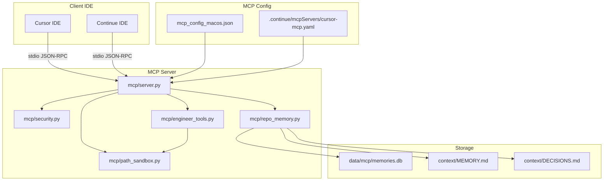

# Senior Engineer MCP Server - Hardening & Enhancement Plan

## Executive Summary

This plan hardens the existing MCP server with security controls, adds engineer tools (git, ripgrep, run_cmd), implements repo memory (MEMORY.md, decision log), and creates verification harness for Cursor/Continue IDEs.

**Current State**: MCP server works via stdio JSON-RPC with basic memory tools.
**Target State**: Production-hardened MCP server with read-only defaults, token-guarded writes, path sandboxing, engineer tools, and full verification.

---

## Architecture Overview



---

## Phase 1: Security Hardening

### 1.1 Add MCP_WRITE_TOKEN Environment Variable Support

**File**: `mcp/server.py`

**Changes**:
- Read `MCP_WRITE_TOKEN` from environment at startup
- Store token in `MCPServer.__init__`
- Add `is_write_allowed(token)` method

**Implementation**:
```python
import os

class MCPServer:
    def __init__(self):
        self.write_token = os.environ.get("MCP_WRITE_TOKEN")
        self.dry_run = os.environ.get("MCP_DRY_RUN", "false").lower() == "true"
        # ... existing code

    def is_write_allowed(self, provided_token: Optional[str]) -> bool:
        """Check if write operation is allowed"""
        if self.dry_run:
            return False
        if self.write_token is None:
            # No token configured = no writes allowed
            return False
        if provided_token is None:
            return False
        return self.write_token == provided_token
```

**Rollback**: Remove token-related code, revert to existing behavior.

---

### 1.2 Implement Read-Only by Default

**File**: `mcp/server.py`

**Changes**:
- Modify `handle_call_tool` to check write permission
- Add `write_token` parameter to write operations
- Return error if write not allowed

**Write Operations**:
- `store_memory` → requires `write_token`
- `memory_append` → requires `write_token`
- `decision_log_add` → requires `write_token`

**Read Operations** (no token required):
- `search_memory`
- `get_context`
- `get_stats`
- `memory_search`
- `decision_log_search`
- All engineer tools

**Implementation**:
```python
def handle_call_tool(self, params: Dict[str, Any]) -> Dict[str, Any]:
    tool_name = params.get("name")
    tool_input = params.get("arguments", {})

    # Check write permission for write operations
    if tool_name in WRITE_OPERATIONS:
        provided_token = tool_input.get("write_token")
        if not self.is_write_allowed(provided_token):
            return {
                "content": [
                    {"type": "text", "text": "Write operation denied: missing or invalid MCP_WRITE_TOKEN"}
                ],
                "isError": True
            }
```

**Rollback**: Remove write permission checks.

---

### 1.3 Add Path Sandboxing Module

**New File**: `mcp/path_sandbox.py`

**Purpose**: Prevent path traversal attacks (`../` escapes)

**Implementation**:
```python
from pathlib import Path
from typing import Optional

class PathSandbox:
    def __init__(self, allowed_root: str):
        self.allowed_root = Path(allowed_root).resolve()

    def validate_path(self, path: str) -> Optional[Path]:
        """Validate path is within allowed root"""
        try:
            resolved = Path(path).resolve()
            # Check if path is within allowed root
            if str(resolved).startswith(str(self.allowed_root)):
                return resolved
            return None
        except Exception:
            return None

    def sanitize_path(self, path: str) -> Optional[str]:
        """Return safe absolute path or None"""
        validated = self.validate_path(path)
        return str(validated) if validated else None
```

**Integration**:
- Initialize in `MCPServer.__init__` with workspace root
- Use in `run_cmd` and file operations

**Rollback**: Delete `mcp/path_sandbox.py`, remove references.

---

### 1.4 Add Dry-Run Mode Support

**File**: `mcp/server.py`

**Changes**:
- Check `MCP_DRY_RUN` environment variable
- Log write operations instead of executing when dry-run is active

**Implementation**:
```python
def handle_call_tool(self, params: Dict[str, Any]) -> Dict[str, Any]:
    tool_name = params.get("name")
    tool_input = params.get("arguments", {})

    # Log dry-run mode
    if self.dry_run and tool_name in WRITE_OPERATIONS:
        logger.info(f"[DRY-RUN] Would execute: {tool_name} with {tool_input}")
        return {
            "content": [
                {"type": "text", "text": f"[DRY-RUN] {tool_name} would execute"}
            ]
        }
```

**Rollback**: Remove dry-run checks.

---

## Phase 2: Engineer Tools

### 2.1 Create Engineer Tools Module

**New File**: `mcp/engineer_tools.py`

**Purpose**: Implement git, ripgrep, and run_cmd tools

**Dependencies** (add to `pyproject.toml`):
```toml
[project.dependencies]
# ... existing
gitpython>=3.1.40
```

---

### 2.2 Git Tools

**Tools to add**:
1. `git_status` - Show working directory status
2. `git_diff` - Show diff between commits or working tree
3. `git_show` - Show commit details

**Implementation**:
```python
import subprocess
from typing import Dict, Any, List

def git_status(cwd: str) -> Dict[str, Any]:
    """Get git status"""
    result = subprocess.run(
        ["git", "status", "--porcelain"],
        cwd=cwd,
        capture_output=True,
        text=True
    )
    return {"status": result.stdout, "returncode": result.returncode}

def git_diff(cwd: str, ref: str = "HEAD") -> Dict[str, Any]:
    """Get git diff"""
    result = subprocess.run(
        ["git", "diff", ref],
        cwd=cwd,
        capture_output=True,
        text=True
    )
    return {"diff": result.stdout, "returncode": result.returncode}

def git_show(cwd: str, ref: str = "HEAD") -> Dict[str, Any]:
    """Show commit details"""
    result = subprocess.run(
        ["git", "show", "--stat", ref],
        cwd=cwd,
        capture_output=True,
        text=True
    )
    return {"show": result.stdout, "returncode": result.returncode}
```

---

### 2.3 Ripgrep Tool

**Tool**: `ripgrep_search`

**Implementation**:
```python
def ripgrep_search(
    cwd: str,
    pattern: str,
    file_pattern: str = "*",
    context_lines: int = 2
) -> Dict[str, Any]:
    """Search using ripgrep (rg)"""
    cmd = [
        "rg",
        pattern,
        "-g", file_pattern,
        "-C", str(context_lines),
        "--json"
    ]
    result = subprocess.run(cmd, cwd=cwd, capture_output=True, text=True)
    return {"results": result.stdout, "returncode": result.returncode}
```

**Note**: Requires `ripgrep` installed on system. Add to docs.

---

### 2.4 Run Command with Allowlist

**Tool**: `run_cmd`

**Security**: Only allow commands from configured allowlist

**Implementation**:
```python
ALLOWED_COMMANDS = {
    "ls": ["ls"],
    "cat": ["cat"],
    "head": ["head"],
    "tail": ["tail"],
    "wc": ["wc"],
    "find": ["find"],
    # Add more as needed
}

def run_cmd(
    cwd: str,
    command: str,
    args: List[str],
    sandbox: PathSandbox
) -> Dict[str, Any]:
    """Run allowed command with sandboxing"""
    # Check command is allowed
    if command not in ALLOWED_COMMANDS:
        return {
            "error": f"Command '{command}' not in allowlist",
            "returncode": -1
        }

    # Validate cwd is within sandbox
    if not sandbox.validate_path(cwd):
        return {
            "error": f"Path '{cwd}' outside sandbox",
            "returncode": -1
        }

    # Execute command
    cmd = [command] + args
    result = subprocess.run(
        cmd,
        cwd=cwd,
        capture_output=True,
        text=True,
        timeout=30  # Prevent hanging
    )
    return {
        "stdout": result.stdout,
        "stderr": result.stderr,
        "returncode": result.returncode
    }
```

---

### 2.5 Register Tools in Server

**File**: `mcp/server.py`

**Changes**: Add tools to `handle_tools_list`:
```python
def handle_tools_list(self, params: Dict[str, Any]) -> Dict[str, Any]:
    return {
        "tools": [
            # ... existing tools
            {
                "name": "git_status",
                "description": "Get git repository status",
                "inputSchema": {
                    "type": "object",
                    "properties": {
                        "cwd": {"type": "string", "description": "Working directory"}
                    },
                    "required": ["cwd"]
                }
            },
            # ... other tools
        ]
    }
```

**Rollback**: Remove engineer tools from `handle_tools_list`, delete `mcp/engineer_tools.py`.

---

## Phase 3: Repo Memory System

### 3.1 Create context/MEMORY.md

**New File**: `context/MEMORY.md`

**Purpose**: Append-only project memory file

**Initial Content**:
```markdown
# Project Memory

This file stores important project context and decisions.

---
```

---

### 3.2 Create Repo Memory Module

**New File**: `mcp/repo_memory.py`

**Implementation**:
```python
from pathlib import Path
from datetime import datetime
from typing import List, Optional

class RepoMemory:
    def __init__(self, memory_file: str):
        self.memory_file = Path(memory_file)
        self.memory_file.parent.mkdir(parents=True, exist_ok=True)
        if not self.memory_file.exists():
            self.memory_file.write_text("# Project Memory\n\n")

    def append(self, content: str, tags: List[str] = None) -> str:
        """Append memory entry"""
        timestamp = datetime.utcnow().isoformat()
        tag_str = " ".join(tags or [])
        entry = f"\n---\n\n## {timestamp}\n"
        if tag_str:
            entry += f"**Tags:** {tag_str}\n\n"
        entry += f"{content}\n"

        with open(self.memory_file, "a") as f:
            f.write(entry)
        return f"Entry appended at {timestamp}"

    def search(self, query: str) -> List[str]:
        """Search memory entries"""
        content = self.memory_file.read_text()
        entries = content.split("\n---\n")
        results = []
        for entry in entries:
            if query.lower() in entry.lower():
                results.append(entry.strip())
        return results
```

---

### 3.3 Decision Log

**New File**: `context/DECISIONS.md`

**Purpose**: Track decisions with timestamps and tags

**Format**:
```markdown
# Decision Log

| Timestamp | Decision | Tags | Context |
|-----------|----------|------|---------|
| 2024-01-15T10:30:00 | Use SQLite for MCP memory | storage, sqlite | Simple, no external deps |
```

**Implementation**:
```python
class DecisionLog:
    def __init__(self, log_file: str):
        self.log_file = Path(log_file)
        self.log_file.parent.mkdir(parents=True, exist_ok=True)
        if not self.log_file.exists():
            self.log_file.write_text("# Decision Log\n\n| Timestamp | Decision | Tags | Context |\n|-----------|----------|------|---------|\n")

    def add(self, decision: str, tags: List[str], context: str = "") -> str:
        """Add decision entry"""
        timestamp = datetime.utcnow().isoformat()
        tag_str = " ".join(tags)
        row = f"| {timestamp} | {decision} | {tag_str} | {context} |\n"

        with open(self.log_file, "a") as f:
            f.write(row)
        return f"Decision logged at {timestamp}"

    def search(self, query: str) -> List[str]:
        """Search decisions"""
        content = self.log_file.read_text()
        lines = content.split("\n")
        results = []
        for line in lines:
            if query.lower() in line.lower():
                results.append(line)
        return results
```

---

### 3.4 Register Repo Memory Tools

**File**: `mcp/server.py`

**Tools to add**:
- `memory_append` (write-protected)
- `memory_search`
- `decision_log_add` (write-protected)
- `decision_log_search`

**Rollback**: Delete `mcp/repo_memory.py`, remove tools from server.

---

## Phase 4: Verification Harness

### 4.1 Create scripts/verify_mcp.sh

**New File**: `scripts/verify_mcp.sh`

**Purpose**: Shell script to verify MCP server functionality

**Implementation**:
```bash
#!/bin/bash
set -e

echo "=== MCP Server Verification ==="

# Check Python
echo "1. Checking Python..."
python3 --version || { echo "Python3 not found"; exit 1; }

# Check dependencies
echo "2. Checking dependencies..."
python3 -c "import mcp" || { echo "MCP module not found"; exit 1; }

# Test server startup
echo "3. Testing server startup..."
echo '{"jsonrpc":"2.0","id":1,"method":"initialize","params":{}}' | python3 mcp/server.py | jq .

# Test tools list
echo "4. Testing tools list..."
echo '{"jsonrpc":"2.0","id":2,"method":"tools/list","params":{}}' | python3 mcp/server.py | jq .

echo "=== Verification Complete ==="
```

**Make executable**: `chmod +x scripts/verify_mcp.sh`

---

### 4.2 Create Tests Directory

**Structure**:
```
tests/
├── __init__.py
├── conftest.py
├── test_mcp_smoke.py
├── test_security.py
├── test_engineer_tools.py
└── test_repo_memory.py
```

---

### 4.3 Create Pytest Smoke Test

**New File**: `tests/test_mcp_smoke.py`

**Implementation**:
```python
import pytest
import json
import subprocess
from pathlib import Path

@pytest.fixture
def server_path():
    return Path(__file__).parent.parent / "mcp" / "server.py"

def test_server_imports(server_path):
    """Test server module imports"""
    result = subprocess.run(
        ["python3", "-c", "import sys; sys.path.insert(0, '.'); from mcp import server"],
        capture_output=True,
        text=True
    )
    assert result.returncode == 0

def test_initialize_request(server_path):
    """Test initialize request"""
    request = {"jsonrpc": "2.0", "id": 1, "method": "initialize", "params": {}}
    result = subprocess.run(
        ["python3", str(server_path)],
        input=json.dumps(request),
        capture_output=True,
        text=True
    )
    assert result.returncode == 0
    response = json.loads(result.stdout)
    assert "result" in response
    assert response["result"]["protocolVersion"] == "2024-11-05"

def test_tools_list(server_path):
    """Test tools list"""
    request = {"jsonrpc": "2.0", "id": 2, "method": "tools/list", "params": {}}
    result = subprocess.run(
        ["python3", str(server_path)],
        input=json.dumps(request),
        capture_output=True,
        text=True
    )
    assert result.returncode == 0
    response = json.loads(result.stdout)
    assert "tools" in response["result"]
    tool_names = [t["name"] for t in response["result"]["tools"]]
    assert "store_memory" in tool_names
    assert "git_status" in tool_names
```

**Rollback**: Delete `tests/` directory and `scripts/`.

---

## Phase 5: Client Configuration

### 5.1 Update mcp_config_macos.json

**File**: `mcp_config_macos.json`

**Changes**:
- Add `MCP_WRITE_TOKEN` placeholder (user must set)
- Add `MCP_DRY_RUN` option
- Update `cwd` to be more portable

**Updated Config**:
```json
{
  "mcpServers": {
    "cursor-mcp": {
      "command": "python3",
      "args": ["./mcp/server.py"],
      "cwd": "/Users/kofirusu/Desktop/Aux./linux mcp-server/cursor-mcp",
      "env": {
        "PYTHONPATH": "/Users/kofirusu/Desktop/Aux./linux mcp-server/cursor-mcp",
        "MCP_WRITE_TOKEN": "YOUR_SECURE_TOKEN_HERE",
        "MCP_DRY_RUN": "false"
      }
    }
  },
  "enabled": true,
  "config": {
    "database": "/Users/kofirusu/Desktop/Aux./linux mcp-server/cursor-mcp/data/memories.db",
    "auto_start": true,
    "load_on_startup": true
  }
}
```

---

### 5.2 Create Continue Config

**New File**: `.continue/mcpServers/cursor-mcp.yaml`

**Implementation**:
```yaml
name: cursor-mcp
description: Senior Engineer MCP Server with git, ripgrep, repo memory
command: python3
args:
  - ./mcp/server.py
cwd: /Users/kofirusu/Desktop/Aux./linux mcp-server/cursor-mcp
env:
  PYTHONPATH: /Users/kofirusu/Desktop/Aux./linux mcp-server/cursor-mcp
  MCP_WRITE_TOKEN: YOUR_SECURE_TOKEN_HERE
  MCP_DRY_RUN: "false"
```

---

### 5.3 Verification Commands

**For Cursor**:
```bash
# Restart Cursor
# Check MCP tools appear in UI
# Test each tool
```

**For Continue**:
```bash
# Restart VS Code with Continue
# Check MCP tools appear in UI
# Test each tool
```

**Rollback**: Revert config files to original state.

---

## Phase 6: Documentation

### 6.1 Update README.md

**Add sections**:
- Security Model
- Available Tools
- Configuration
- Troubleshooting

### 6.2 Create SECURITY.md

**New File**: `docs/SECURITY.md`

**Contents**:
- Write token setup
- Dry-run mode
- Path sandboxing
- Allowlist configuration

### 6.3 Create VERIFICATION.md

**New File**: `docs/VERIFICATION.md`

**Contents**:
- Verification steps
- Expected outputs
- Common issues

---

## Checkpoints

| Phase | Checkpoint | Success Criteria |
|-------|-----------|------------------|
| 1 | Security hardening | Write operations reject without token, dry-run works, path sandbox blocks `../` |
| 2 | Engineer tools | git_status, git_diff, git_show, ripgrep_search, run_cmd all work |
| 3 | Repo memory | MEMORY.md and DECISIONS.md created, append/search work |
| 4 | Verification | `./scripts/verify_mcp.sh` passes, `pytest tests/test_mcp_smoke.py` passes |
| 5 | Client config | Cursor/Continue show tools in UI, tools execute correctly |
| 6 | Documentation | All docs updated, security model documented |

---

## Rollback Notes

### Per-Phase Rollback

| Phase | Files to Delete | Files to Revert |
|-------|-----------------|-----------------|
| 1 | `mcp/path_sandbox.py` | `mcp/server.py` (remove security code) |
| 2 | `mcp/engineer_tools.py` | `mcp/server.py`, `pyproject.toml` |
| 3 | `mcp/repo_memory.py`, `context/` | `mcp/server.py` |
| 4 | `scripts/`, `tests/` | None |
| 5 | `.continue/` | `mcp_config_macos.json` |
| 6 | `docs/SECURITY.md`, `docs/VERIFICATION.md` | `README.md` |

### Full Rollback Command

```bash
# Delete new files
rm -rf mcp/path_sandbox.py mcp/engineer_tools.py mcp/repo_memory.py
rm -rf context/ scripts/ tests/ .continue/
rm -f docs/SECURITY.md docs/VERIFICATION.md

# Revert modified files
git checkout mcp/server.py pyproject.toml mcp_config_macos.json README.md
```

---

## Verification Commands

After implementation, run these commands to verify success:

```bash
# 1. Run verification script
./scripts/verify_mcp.sh

# 2. Run pytest
pytest tests/test_mcp_smoke.py -v

# 3. Test dry-run mode
MCP_DRY_RUN=true python3 mcp/server.py < test_write_request.json

# 4. Test write protection (should fail without token)
echo '{"jsonrpc":"2.0","id":1,"method":"tools/call","params":{"name":"store_memory","arguments":{"domain":"test","content":"test"}}}' | python3 mcp/server.py

# 5. Test with valid token
MCP_WRITE_TOKEN=test_token echo '{"jsonrpc":"2.0","id":1,"method":"tools/call","params":{"name":"store_memory","arguments":{"domain":"test","content":"test","write_token":"test_token"}}}' | python3 mcp/server.py
```

---

## Dependencies to Add

**pyproject.toml**:
```toml
dependencies = [
    # ... existing
    "gitpython>=3.1.40",
]
```

---

## Summary

This plan implements a production-hardened MCP server with:

1. **Security**: Read-only by default, token-guarded writes, path sandboxing, dry-run mode
2. **Engineer Tools**: git operations, ripgrep search, safe command execution
3. **Repo Memory**: Append-only MEMORY.md, decision log with timestamps/tags
4. **Verification**: Shell script and pytest smoke tests
5. **Client Support**: Configs for both Cursor and Continue IDEs

All changes are minimal diffs, preserving existing architecture while adding the requested capabilities.
